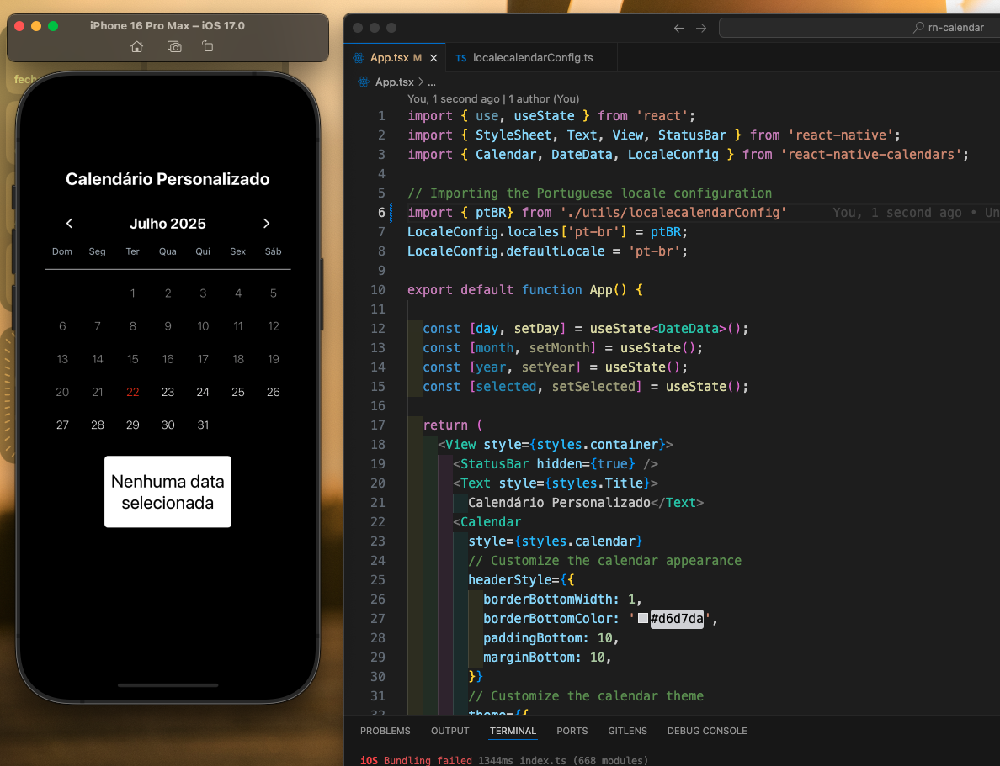

# The power of organization in the palm of your hand! | React Native Calendars


<p>If you're building a mobile app and need a functional, beautiful, and easy-to-use calendar component, the react-native-calendars package is the perfect choice.</p>

## Getting Started 🔧

Here's how to get started with react-native-calendars in your React Native project:

### Install the package:

```
$ yarn add react-native-calendars
````

RN Calendars is implemented in JavaScript, so no native module linking is required.

### Usage 🚀

Basic usage examples of the library. Importing the Calendar component.
```
import React from 'react';
import { View, Text } from 'react-native';
import { Calendar } from 'react-native-calendars';

export default function App() {
  return (
    <View style={{ flex: 1, paddingTop: 50 }}>
      <Text style={{ fontSize: 24, textAlign: 'center', marginBottom: 10 }}>
        Meu Calendário
      </Text>
      <Calendar
        onDayPress={day => {
          console.log('Selecionado:', day.dateString);
        }}
        markedDates={{
          '2025-07-25': { selected: true, marked: true, selectedColor: '#00adf5' },
        }}
      />
    </View>
  );
}
```
Or customize like this.
````
import { use, useState } from 'react';
import { StyleSheet, Text, View, StatusBar } from 'react-native';
import { Calendar, DateData, LocaleConfig } from 'react-native-calendars';  

// Importing the Portuguese locale configuration
import { ptBR} from './utils/localecalendarConfig'
LocaleConfig.locales['pt-br'] = ptBR;
LocaleConfig.defaultLocale = 'pt-br';

export default function App() {

  const [day, setDay] = useState<DateData>();
  const [month, setMonth] = useState();
  const [year, setYear] = useState();
  const [selected, setSelected] = useState();

  return (
    <View style={styles.container}>
      <StatusBar hidden={true} />
      <Text style={styles.Title}>
        Calendário Personalizado</Text>
      <Calendar
        style={styles.calendar}
        // Customize the calendar appearance
        headerStyle={{
          borderBottomWidth: 1,
          borderBottomColor: '#d6d7da',
          paddingBottom: 10,
          marginBottom: 10,
        }}
        // Customize the calendar theme
        theme={{
          monthTextColor: '#ffffff',
          textMonthFontWeight: 'bold',
          textMonthFontSize: 20,
          todayTextColor: '#f53100',
          selectedDayBackgroundColor: '#f53100',
          selectedDayTextColor: '#ff0000',
          arrowColor: '#ffffff',
          calendarBackground:'transparent',

          textDayStyle: {
            color: '#ffffff',
          },
          textDisabledColor: '#999',

          arrowStyle:{
            marginHorizontal: 10,
          }
          
        }}

        // Disable past dates
        minDate={new Date().toISOString().split('T')[0]} 
        hideExtraDays={true}

        // Set the initial date
        onDayPress={setDay}
        // handle date selection
        markedDates={
          day && {
            [day.dateString]: {selected: true, marked: true, selectedColor: '#fff' }
          }
        }

        
        />
        <View style={{alignItems:'center'}}>
          <Text  style={styles.dateSelected}>
            { 
              day 
                ? ` ${(() => {
                      const [year, month, date] = day.dateString.split('-');
                      return `${date}-${month}-${year.slice(2)}`;
                  })()}`
                : 'Nenhuma data selecionada'
            }
          </Text>
        </View>
    </View>
  );
}

const styles = StyleSheet.create({
  container: {
    flex: 1,
    backgroundColor: '#000',
    paddingTop:100,
    paddingHorizontal: 20,
  },
  calendar:{  
    backgroundColor:'transparent',
  },
  Title:{
    color: '#fff',
    fontSize: 24,
    marginVertical: 20,
    textAlign: 'center',
    fontWeight: 'bold',
  },
  dateSelected: {
    marginTop: 20,
    borderRadius: 5,
    width:'50%',
    paddingVertical: 20,
    color: '#000',
    fontSize: 25,
    textAlign: 'center',
    backgroundColor:'#fff'
  },

});

````
